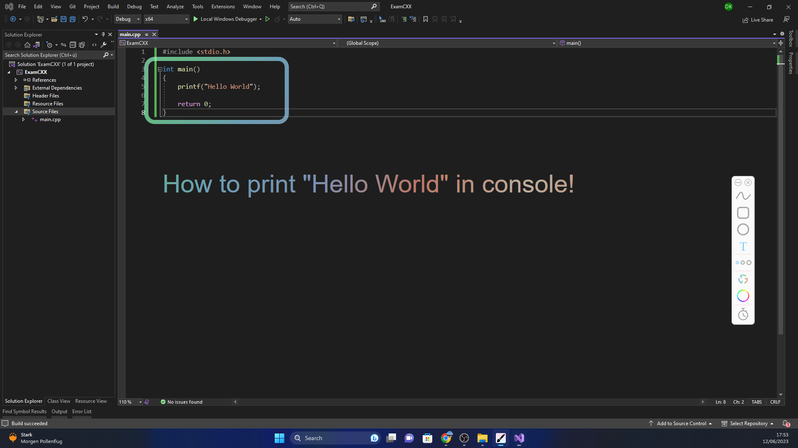
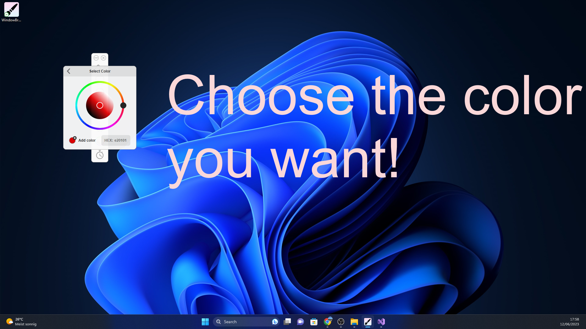
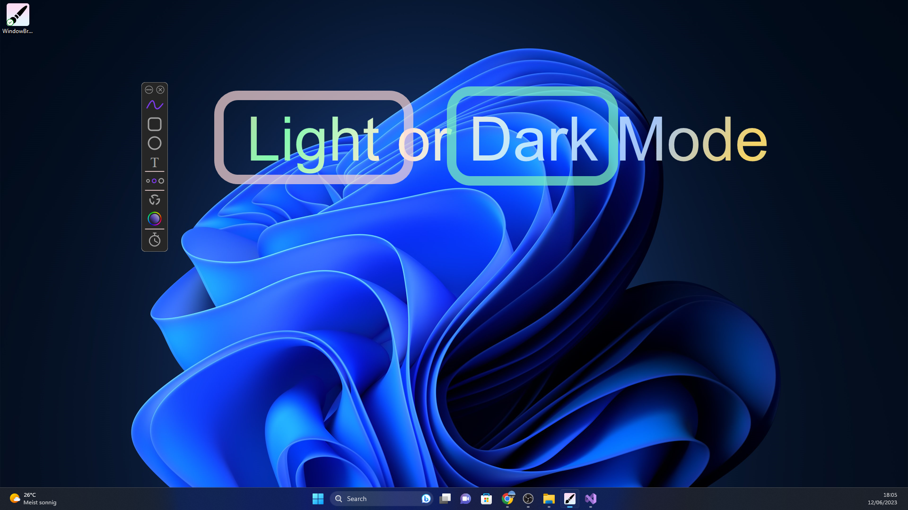
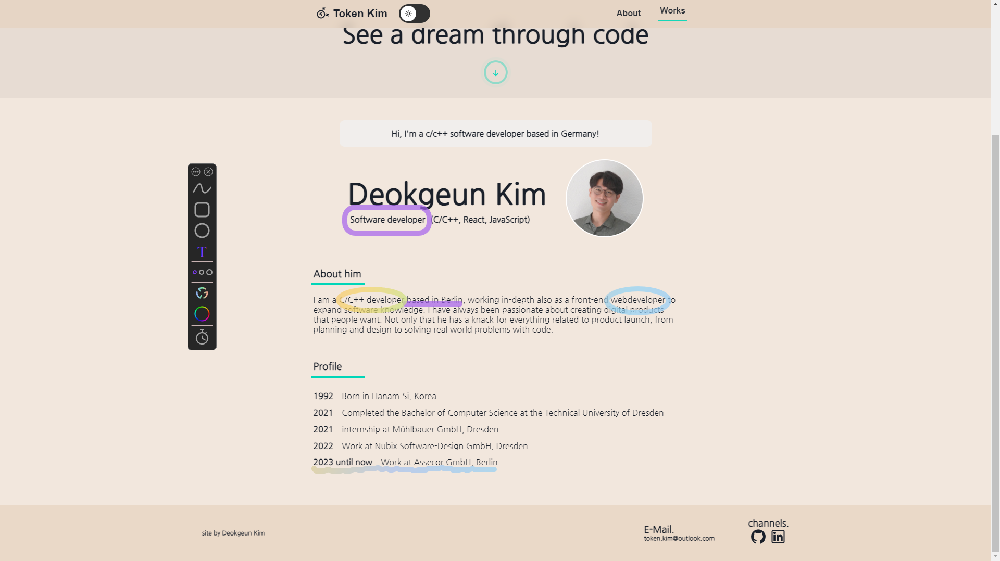

# WindowBrush

Draw over the selected entire screen.

Quick and useful to show something on the screen by drawing.

Designed to be easy and intuitive to use. A clean, modern and stylish interface always works as expected.

## How to execute

Download as zip or clone the repository and run WindowBrush.exe. That's it!

Because it includes an executable file, there are cases in `Edge` cannot download it when downloading with Zip.

In this case, download it from `Chrome`.

## How to use

Select the screen you want to draw on at the setting mode ( Click the circle in the top left corner ) and draw something by clicking the buttons or using hotkeys.

## Used tools

- C++
- MFC library
- Visual Studio

## Overview

  
  
  

## How can it actually be used

  
